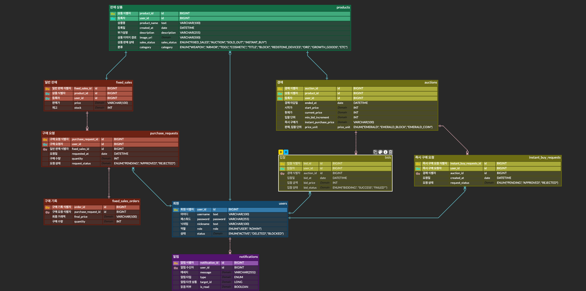

#  웹 경매 시스템 (Auction System)

실시간 경매 및 정가 판매 기능을 제공하는 웹 애플리케이션입니다. 사용자 간의 상품 거래를 보다 쉽고 투명하게 관리할 수 있도록 설계되었습니다.

---

## 1. 개요
- **프로젝트 명**: AB 웹 경매 시스템
- **주요 기능**: 
  - **실시간 경매**: 입찰 방식을 통한 상품 거래 기능
  - **정가 판매**: 지정된 가격으로 즉시 구매 가능한 판매 방식 지원
  - **알림 서비스**: 입찰 성공, 낙찰, 판매 상태 변경 등에 대한 실시간 알림 제공
  - **어드민 대시보드**: 사용자, 상품, 거래 내역 통계 및 관리 기능
  - **마이페이지**: 개인별 입찰 내역, 구매/판매 내역 관리 및 프로필 수정

>

---

## 2. Skill

### Backend
- **Java 17 & Spring Boot 3**: 견고하고 확장성 있는 엔터프라이즈 급 백엔드 아키텍처 구축을 위해 사용되었습니다.
- **Spring Data JPA & QueryDSL**: 객체 지향적인 데이터 접근과 복잡한 동적 쿼리(상품 필터링 등)를 타입 세이프하게 구현하기 위해 도입했습니다.
- **MySQL**: 신뢰성 높은 관계형 데이터베이스로 사용자 및 거래 데이터를 안정적으로 저장합니다.
- **Redis**: 고성능 인메모리 데이터 저장소로, 실시간성 데이터 처리 및 캐싱을 위해 활용됩니다.
- **Spring Security & JWT (jjwt)**: Stateless한 인증 방식을 통해 보안을 강화하고 서버 확장성을 확보했습니다.
- **SpringDoc OpenAPI (Swagger)**: 프론트엔드와의 협업을 위해 API 문서를 자동화하여 제공합니다.

### Frontend
- **React 19 & TypeScript**: 최신 리액트 기능을 활용하고 정적 타입 검사를 통해 런타임 에러를 방지하며 개발 생산성을 높였습니다.
- **Vite**: 빠른 번들링과 개발 서버 환경을 제공하여 최적의 DX(Developer Experience)를 구축했습니다.
- **Zustand**: Redux 대비 가볍고 직관적인 상태 관리 라이브러리로 전역 상태(사용자 인증 정보 등)를 효율적으로 관리합니다.
- **Tailwind CSS & Material Tailwind**: Utility-first 스타일링과 UI 컴포넌트 라이브러리를 결합하여 빠르고 일관된 디자인 시스템을 구축했습니다.
- **Axios**: 서버와의 비동기 통신을 위해 인터셉터 기반의 HTTP 클라이언트를 구성했습니다.

---

## 3. DB (ERD)

데이터베이스 아키텍처는 다음과 같은 주요 엔티티를 중심으로 설계되었습니다.

- **User**: 시스템 사용자 (일반 회원 - 관리자 역할 구분)
- **Product**: 판매 또는 경매의 대상이 되는 상품 (카테고리, 이미지, 설명 포함)
- **Auction**: 상품의 경매 정보 (시작가, 입찰 단위, 종료 시간 등)
- **FixedSale**: 상품의 일반 판매 정보 (고정 가격, 재고 등)
- **Bid**: 경매 입찰 내역 (입찰자, 입찰가, 상태 등)
- **FixedSaleOrder**: 일반 판매 주문 정보
- **Notification**: 사용자별 실시간 알림 정보
- **BaseTimeEntity**: 엔티티의 생성/수정 시간을 관리하는 공통 부모 엔티티



---

## 4. API Specification

모든 API는 `/api/v1` 프리픽스를 사용하며, 주요 엔드포인트 그룹은 다음과 같습니다.

- **Auth & User**: `/api/v1/auth`, `/api/v1/users` (회원가입, 로그인, 이메일 인증, 프로필 관리)
- **Product**: `/api/v1/products` (상품 등록, 수정, 조회 및 필터링)
- **Auction & Bid**: `/api/v1/auctions`, `/api/v1/bids` (경매 시작, 입찰 진행, 낙찰 처리)
- **Fixed Sale**: `/api/v1/fixed-sales`, `/api/v1/purchase-requests` (정가 판매 등록 및 즉시 구매 요청)
- **Notification**: `/api/v1/notifications` (사용자 알림 조회 및 읽음 처리)
- **Admin**: `/api/v1/admin`, `/api/v1/admin/dashboard` (시스템 통계 및 리소스 관리)

> 상세 API 명세는 서버 실행 후 `http://localhost:8080/swagger-ui.html`에서 확인할 수 있습니다.

---

## 5. 사용 방법

### 환경 설정
- **Java**: JDK 17 이상
- **Node.js**: v20 이상
- **MySQL & Redis**: 로컬 또는 외부 서버 설치 및 실행 필요

### Backend 설치 및 실행
1. `backend/.env.template` 파일을 `.env`로 복사하고 환경 변수(DB 계정 등)를 설정합니다.
2. 터미널에서 다음 명령어를 실행합니다.
   ```bash
   cd backend
   ./gradlew bootRun
   ```

### Frontend 설치 및 실행
1. `frontend/.env.template` 파일을 `.env`로 복사하고 API 서버 주소를 설정합니다.
2. 터미널에서 다음 명령어를 실행합니다.
   ```bash
   cd frontend
   npm install
   npm run dev
   ```

3. 브라우저에서 `http://localhost:5173` 접속을 통해 시스템을 확인할 수 있습니다.
